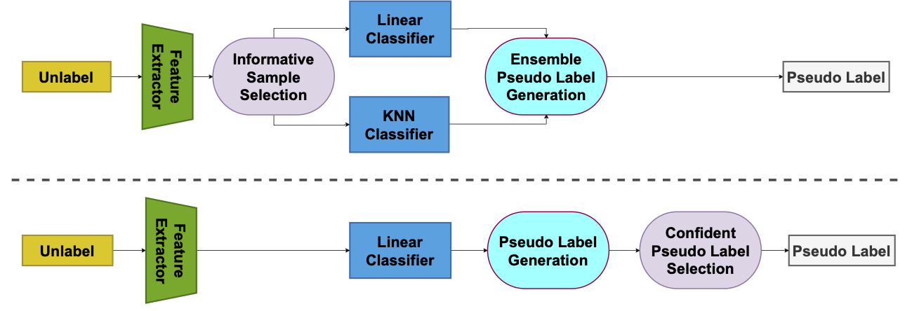
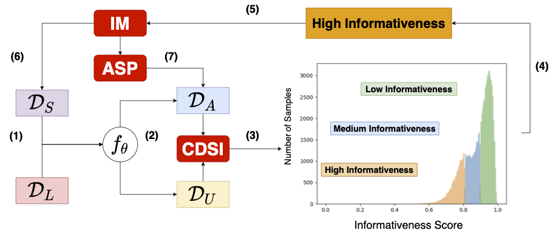

# ACPL

This repository is the official implementation of [ACPL: Anti-curriculum Pseudo-labelling for Semi-supervised Medical Image Classification ](https://arxiv.org/abs/2111.12918). 

<!--  -->

## Requirements

- To install requirements:
  ```setup
  pip install -r requirements.txt
  ```
- This code is tested in two NVIDIA GTX 2080ti. Single card is supported but performance cannot guarantee. 
## Datasets Preparation
- First, please download Chest X-ray14 from https://nihcc.app.box.com/v/ChestXray-NIHCC
- Move train_val_list_2_1.txt to data directory
## Training
1. 2% labelled set semi-supervised training:
    ```
    CUDA_VISIBLE_DEVICES=0,1 python main.py --data <data_dir> --task cx14 --resize 512 --batch-size 8 --epochs 20  --dist-url 'tcp://localhost:10001' --multiprocessing-distributed --world-size 1 --rank 0  --desc ACPL_2_1_k200 --num-workers 4 --eval-interval 100 --reinit --label_ratio 2 --runtime 1 --topk 200 --pl-epochs 10  --ds-mixup --sel 2 --num-gmm-sets 3 --lr 0.03  --resume <resume_from_ck>
    ```
    where the arguments represent:
      * `data_dir` - Chest X-ray14 root dir
      * `desc` - folder name for experiment description
      * `label_ratio` - labelled set size
      * `runtime` - multiple run
      * `topk` - KNN K
      * `pl-epochs` - train epochs for after assign pseudo labels
      * `ds-mixup` - use density mixup
      * `sel` - select high informative subset
      * `num_gmm-sets` - {low, medium, high} number of GMM sets
      * `resume` - resume from supervised training checkpoint, remove if training from scratch

2. In origin paper we use DenseNet-121 as backbone and compute graph on GPU with Faiss. For larger backbone, You can switch to CPU in case GPU memory runout.
## Citation

If you find this repo useful for your research, please consider citing our paper:

```bibtex
@article{@article{liu2021acpl,
  title={ACPL: Anti-curriculum Pseudo-labelling forSemi-supervised Medical Image Classification},
  author={Liu, Fengbei and Tian, Yu and Chen, Yuanhong and Liu, Yuyuan and Belagiannis, Vasileios and Carneiro, Gustavo},
  journal={arXiv preprint arXiv:2111.12918},
  year={2021}
}
```

<!-- # ACPL: Anti-curriculum Pseudo-labelling for Semi-supervised Medical Image Classification
## Introduction
Pytorch code for *ACPL* paper
## Prerequisites
Required packages to run:
* Python 3.8
* Pytorch 1.10.0
* torchvision 0.11.1
* loguru 0.5.3
* faiss 1.7.1

The code is tested in two NVIDIA GTX 2080ti. Single card is supported but performance cannot guarantee.

## Quick run of the code
1. First, please download Chest X-ray14 from https://nihcc.app.box.com/v/ChestXray-NIHCC  
2. Move train_val_list_2_1.txt to data directory
3. 2% labelled set semi-supervised training:
    ```
    CUDA_VISIBLE_DEVICES=0,1 python main.py --data <data_dir> --task cx14 --resize 512 --batch-size 8 --epochs 20  --dist-url 'tcp://localhost:10001' --multiprocessing-distributed --world-size 1 --rank 0  --desc ACPL_2_1_k200 --num-workers 4 --eval-interval 100 --reinit --label_ratio 2 --runtime 1 --topk 200 --pl-epochs 10  --ds-mixup --sel 2 --num-gmm-sets 3 --lr 0.03  --resume <resume_from_ck>
    ```
    where the arguments represent:
      * `data_dir` - Chest X-ray14 root dir
      * `desc` - folder name for experiment description
      * `label_ratio` - labelled set size
      * `runtime` - multiple run
      * `topk` - KNN K
      * `pl-epochs` - train epochs for after assign pseudo labels
      * `ds-mixup` - use density mixup
      * `sel` - select high informative subset
      * `num_gmm-sets` - {low, medium, high} number of GMM sets
      * `resume` - resume from supervised training checkpoint, remove if training from scratch -->
